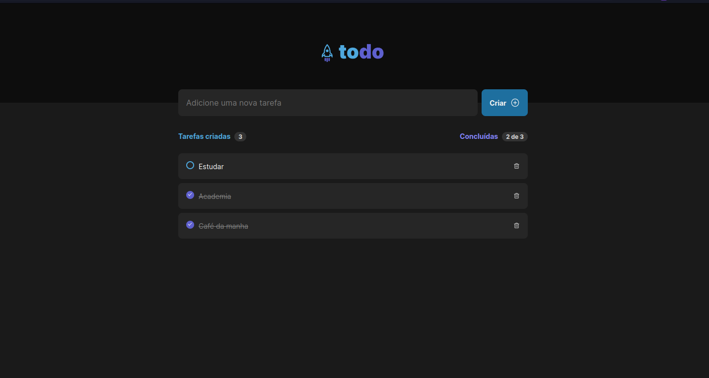

<span align="center">
  
</span>

## 💻 Project

ToDoList is a to-do management app

</br>
</br>

## ⚙ Technologies
This project was developed with the following technologies:

- [Vite](https://vitejs.dev)
- [ReactJS](https://reactjs.org)
- [TypeScript](https://www.typescriptlang.org/)

## 👷 How to run 🚀

Install the dependencies of each project:
```bash
# Install the dependencies
$ npm i
# Start the project
$ npm run dev
```

## 🔖 Layout

- [Figma](https://www.figma.com/file/7PVW52ePwP8mOK0wAqmixF/ToDo-List-(Copy)?t=vF8HVCedkz9pfMS3-0)

## 📝 License

- [LICENSE](License.md).